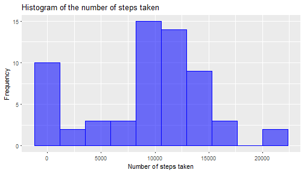
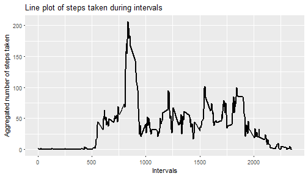
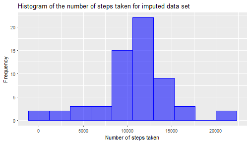
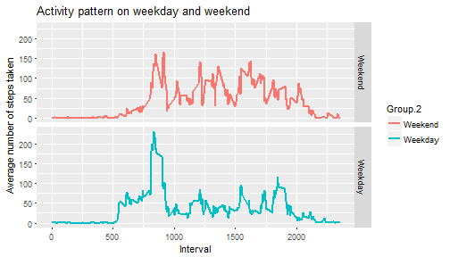

Analysis of Activity Monitoring Data
======================================
###Getting started
The first step is to set the global options, echo = TRUE in this case


```r
knitr::opts_chunk$set(echo = TRUE, fig.height = 4, warning = FALSE, message = FALSE)
```

Now, we load the required package. I am going to load the 'ggplot2' packages for making all the plots, because I find them beautiful. I am also going to use lubridate package for easier handling of dates and time classes


```r
library(ggplot2)
library(lubridate)
```

###Loading and preprocessing the data
We unzip the file and read the data. Then, let's take a look at the structure of the data


```r
activity_zip = unzip('activity.zip')
activity = read.csv(activity_zip[1], header = TRUE, stringsAsFactors = FALSE)
str(activity)
```

```
## 'data.frame':	17568 obs. of  3 variables:
##  $ steps   : int  NA NA NA NA NA NA NA NA NA NA ...
##  $ date    : chr  "2012-10-01" "2012-10-01" "2012-10-01" "2012-10-01" ...
##  $ interval: int  0 5 10 15 20 25 30 35 40 45 ...
```

It appears that the date varaible has been read as a character variable. So, we need to 
convert it into the date format


```r
activity$date = as.Date(activity$date, '%Y-%m-%d')
```

###Total number of steps taken per day
Now, we need to create a histogram of the total number of steps taken every day. For this, first we calculate the aggregated measure. After plotting the histomgram, we calculate the mean and median number of step taken


```r
total_steps = aggregate(activity$steps, by = list(activity$date), sum, na.rm =TRUE)
ggplot(data = total_steps, aes(x, fill = I('blue'), alpha = 0.5, color = I('blue'))) + geom_histogram(bins = 10) + theme(legend.position = 'none')+xlab('Number of steps taken')+ ylab('Frequency') + ggtitle('Histogram of the number of steps taken')
```



```r
mean_step = round(mean(total_steps$x, na.rm = TRUE),2)
median_step = median(total_steps$x, na.rm = TRUE)
```
The mean number of steps taken (rounded up to two figures is) 9354.23 and the median number of step taken is 10395.

###Average daily activity pattern

```r
pattern = aggregate(activity$steps, by = list(activity$interval), mean, na.rm = TRUE)
ggplot(data = pattern, aes(Group.1, x))+ geom_line(show.legend = FALSE, size = 1) + xlab("Intervals")+ylab("Aggregated number of steps taken") + ggtitle("Line plot of steps taken during intervals")
```



```r
max_step = pattern$Group.1[which.max(pattern$x)]
step_time = seconds_to_period(max_step*60)
next_time = seconds_to_period((max_step+5)*60)
```

The plot shows how the number of steps taken varies across every 5 minutes interval, averaged over all days in the data. It also tells us that on an average, the user takes the maximum number of steps during the 835th interval, which roughly converts to the interval between 13:55 - 14:0 hrs.

###Imputing Missing Values

There are a number of days/intervals where there are missing values (coded as NA). The presence of missing days may introduce bias into some calculations or summaries of the data. First, we find out how many values are missing and then, we replace these by the values by mean of that 5-minute interval. The strategy is to

a. create a "pattern "dataframe which contains the averages for all 5 minute intervals
b. We find out which values are missing from the "steps" column of the "activity" dataframe
c. We find out the "interval" values of these dataframes and find the corresponding indices of the "pattern" dataframe.
d. the "x" column of the dataframe is used to impute the missing values.


```r
no_NA = is.na(activity$steps)

activity_imputed = activity

ix = unlist(lapply(activity_imputed$interval[which(no_NA)], function(x) which(x == pattern$Group.1)))

activity_imputed$steps[which(no_NA)] = pattern$x[ix]

new_total_steps = aggregate(activity_imputed$steps, by = list(activity_imputed$date), sum)

ggplot(data = new_total_steps, aes(x, fill = I('blue'), alpha = 0.5, color = I('blue'))) + geom_histogram(bins = 10) + theme(legend.position = 'none')+xlab('Number of steps taken')+ ylab('Frequency') + ggtitle('Histogram of the number of steps taken for imputed data set')
```



```r
new_mean_step = round(mean(new_total_steps$x, na.rm = TRUE),2)
new_median_step = median(new_total_steps$x, na.rm = TRUE)
```

We observe that there are a total of 17568 missing values. After the above-mentioned imputations, it is observed that the new mean and median number of steps taken are **different** from the previous ones. The new mean and median number of steps taken are 10766.19 and 10766.1886792453 respectively. This is beacause, on an average, the sum of the missing values was greater than the overall sum everyday

## Activity pattern in weekday and weekend
First we create a variable, which identifies, whether the day is a weekday or a weekend.Then, we aggregate the number of steps accordingly and carry on to build the graphs

```r
temp = weekdays(activity_imputed$date)
activity_imputed$day_type = factor(temp %in% c('Saturday','Sunday'), levels = c(TRUE, FALSE), labels = c('Weekend', 'Weekday'))

steps = aggregate(activity_imputed$steps, by = list(activity_imputed$interval, activity_imputed$day_type), mean)

ggplot(data = steps, aes(Group.1, x,color = Group.2)) + facet_grid(Group.2~.) + geom_line(size = 1) + xlab('Interval') + ylab('Average number of steps taken') + ggtitle('Activity pattern on weekday and weekend')
```



It is clear from the plot that there are marked differences between the number of steps taken on weekday and weekend. The user tends to take larger number of steps, all throughout the day for weekend (possibly to visit nearby malls or other recreational zones). On weekdays, (s)he walks a greater number of steps in the morning (probably going to the office) and then, walks small distances throughout the rest of the day

That's all Folks!!


```r
knitr::knit2html(PA1_template)
```

```
## Error in file(input, encoding = encoding): object 'PA1_template' not found
```
